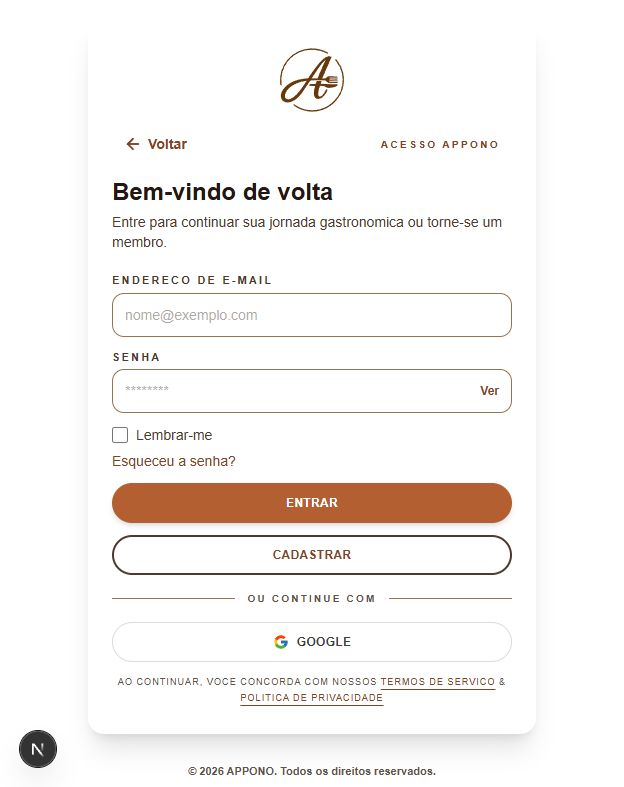
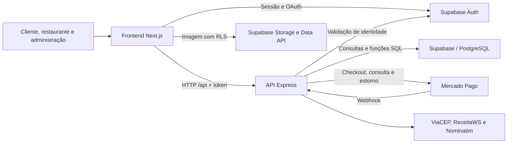

<p align="center">
  
</p>

# Appono

**Reservas de mesas, pedidos antecipados e operação de restaurantes em uma plataforma.**

[](frontend/package.json)
[](frontend/package.json)
[](backend/package.json)
[](backend/src/lib/supabase.js)

O Appono conecta o planejamento do cliente à rotina do restaurante: descobrir um estabelecimento, reservar uma mesa, antecipar o pedido e acompanhar o atendimento. O restaurante gerencia agenda, cardápio, cozinha e financeiro; a administração acompanha suporte e operações financeiras.

O projeto está em desenvolvimento, com módulos implementados e integrações que exigem configuração e validação em ambiente de testes. A execução local utiliza um projeto Supabase com o schema do Appono. **O repositório ainda não contém o schema inicial completo para provisionar um banco vazio.** Consulte a [preparação do Supabase](docs/preparacao-supabase.md) antes da instalação.

## Sumário

- [Funcionalidades e estado atual](#funcionalidades-e-estado-atual)
- [Appono Rotina](#appono-rotina)
- [Appono Intelligence](#appono-intelligence)
- [Interface](#interface)
- [Tecnologias e arquitetura](#tecnologias-e-arquitetura)
- [Estrutura do repositório](#estrutura-do-repositório)
- [Instalação](#instalação)
- [Variáveis de ambiente](#variáveis-de-ambiente)
- [Supabase e migrations](#supabase-e-migrations)
- [Execução local](#execução-local)
- [Comandos e verificações](#comandos-e-verificações)
- [Solução de problemas](#solução-de-problemas)
- [Documentação complementar](#documentação-complementar)
- [Contribuição e licença](#contribuição-e-licença)

## Funcionalidades e estado atual

| Área | Recursos presentes no código | Dependências e limites |
| --- | --- | --- |
| Contas | Cadastro de cliente e restaurante, login, recuperação de senha e acesso com Google | Supabase Auth e perfis no banco; Google e envio de e-mails exigem configuração externa |
| Descoberta | Busca, perfis públicos, cardápios, favoritos e avaliações após a entrega | Schema e RLS; geolocalização depende das coordenadas e de consultas externas |
| Reservas e pedidos | Disponibilidade de mesas, consumo mínimo, pedido antecipado, confirmação de presença e check-in | Funções SQL e migrations; regras operacionais descritas no guia de fluxos |
| Restaurante | Gestão do cardápio, agenda, fila da cozinha, histórico e indicadores | Perfil autenticado e dados operacionais; a janela da cozinha é definida no código |
| Pagamentos | Checkout Pro, conexão OAuth de restaurantes, webhook, financeiro e solicitação de reembolso | Credenciais Mercado Pago, URLs de integração e modo financeiro; simulação e estorno no gateway têm comportamentos distintos |
| Atendimento | Chat entre participantes, notificações internas, chamados e análise administrativa | Migrations de chat e suporte, autenticação e validação de propriedade |
| Appono Rotina | Perfil, endereço geocodificado, até oito janelas alimentares, planejamento, Google Agenda, recomendações explicáveis, segurança alimentar, feedback privado e conversão em reserva ou pedido | Escritas transacionais, controle de concorrência, RLS e feature flags; a exportação para o Google exige reconexão das contas antigas |

Estão pendentes de validação para um piloto financeiro: concorrência real, matriz RLS entre usuários, webhooks e estornos no sandbox, conciliação periódica independente das telas, alertas externos e restauração de backup. Os documentos de operação e piloto descrevem requisitos; não representam automações já entregues. Veja os [limites e pendências](docs/fluxos-operacionais.md#prontidão).

## Appono Rotina

O **Appono Rotina** ajuda o cliente a transformar preferências alimentares e horários do dia em um planejamento semanal de refeições. O fluxo foi desenhado para priorizar o planejamento já existente: ao acessar a área, o cliente é levado diretamente à sua semana; quando ainda não há planejamento, vê apenas a opção de configurar suas preferências.

O cliente informa restrições e preferências alimentares, endereço e janelas de refeição. Com esses dados, a plataforma gera sugestões de restaurantes explicáveis e compatíveis com a rotina, permitindo aprovar, trocar ou recusar cada sugestão. As escolhas aprovadas podem seguir para reserva de mesa ou pedido antecipado, conforme a operação disponível no restaurante.

Cada planejamento fica persistido por semana. Ao entrar no módulo, a aplicação prioriza a semana que contém a data atual e, quando ela ainda não existe, a próxima semana planejada. O cliente pode consultar no máximo a semana imediatamente anterior; períodos mais antigos permanecem preservados no banco, mas não ficam expostos no módulo. Geração e regeneração retroativas são bloqueadas no frontend, na API e no domínio.

### Appono Intelligence

O planejamento usa o `deterministico-v3` como modelo oficial. A `appono-intelligence-v1` permanece congelada como referência histórica, enquanto a `appono-intelligence-v2` está integrada ao fluxo real para avaliação controlada. Restrições, alergias, agenda, funcionamento, orçamento e disponibilidade continuam sendo filtros obrigatórios; a inteligência apenas ordena opções já consideradas elegíveis e seguras, sem depender de um provedor externo de IA.

A V2 permanece com rollout público igual a zero. Em desenvolvimento e homologação, contas consentidas de uma allowlist podem usar sua decisão; falha, baixa confiança, ausência de histórico ou kill switch retornam automaticamente ao `deterministico-v3`.

Em `/cliente/configuracoes`, o cliente pode ativar ou revogar o uso de novas interações na personalização. O consentimento vem desativado por padrão e não apaga reservas, pedidos ou registros financeiros. O painel privado `/admin/rotina-intelligence` mostra métricas e estado operacional sem expor sinais ou identidades.

Os comandos `simulate:rotina:intelligence` e `evaluate:rotina:intelligence` executam a avaliação longitudinal reproduzível. O estado e as limitações estão em [docs/appono-intelligence-v2-relatorio-pre-piloto.md](docs/appono-intelligence-v2-relatorio-pre-piloto.md).

A migration `20260921204635_routine_behavioral_consent_and_signals.sql` cria consentimento versionado, histórico auditável e sinais privados idempotentes. Aplique-a antes de publicar backend e frontend. A coleta DEMO usa `npm.cmd run collect:rotina:behavior --workspace backend` com `APPONO_REMOTE_SMOKE=confirmado`.

Para avaliação em desenvolvimento ou homologação, o projeto inclui um [seed sintético do Appono Rotina](docs/appono-rotina-populacao-avaliacao.md) com restaurantes, cardápios, segurança alimentar e clientes fictícios. A execução exige confirmação explícita, é bloqueada quando `NODE_ENV=production` e possui limpeza restrita aos usuários de demonstração.

No fluxo de reserva, iniciar o checkout cria uma reserva pendente e bloqueia a mesa temporariamente. Após o pagamento aprovado, a reserva é confirmada e a mesa permanece indisponível para o horário reservado. A mesa volta a ser elegível para novas reservas quando a visita é concluída pelo restaurante, a reserva é cancelada ou o cliente é marcado como não compareceu.

As regras de disponibilidade consideram horário de funcionamento, conflito de reservas e status operacional da reserva. Integrações de agenda, notificações, grupos e insights dependem das respectivas feature flags e configurações externas.

## Interface

<p align="center">
  
</p>

Captura de desenvolvimento já presente no repositório. Outras referências visuais estão em [docs/figma-screenshots](docs/figma-screenshots); podem representar versões anteriores da interface.

## Tecnologias e arquitetura

| Camada | Tecnologias | Responsabilidade |
| --- | --- | --- |
| Interface | Next.js 16, React 19, Tailwind CSS 4 | Páginas, componentes e interação dos três perfis |
| API | Node.js, Express 5, JavaScript | Autorização, regras de negócio e integrações |
| Dados | Supabase/PostgreSQL, Auth e Storage | Identidade, persistência, funções SQL, RLS e imagens |
| Pagamentos | SDK Mercado Pago | Checkout Pro, consulta de pagamentos, OAuth e estornos |
| Desenvolvimento | npm workspaces, concurrently, nodemon, ESLint, `node:test` | Execução do monorepo e verificações locais |

As versões declaradas ficam nos manifests de [frontend](frontend/package.json) e [backend](backend/package.json); o [lockfile](package-lock.json) registra as resoluções das dependências.



As regras puras ficam em `backend/src/domain`; rotas coordenam HTTP, autorização e serviços. O frontend usa a API Express nos fluxos de negócio e o cliente Supabase para sessão e upload de imagens. A chave administrativa permanece no backend; operações privilegiadas dependem das verificações de perfil e propriedade da API.

## Estrutura do repositório

Árvore resumida dos arquivos e diretórios usados pela aplicação, configuração, testes e documentação. Inclui os arquivos novos das alterações atuais; módulos repetitivos são agrupados por diretório.

```text
Appono/
├── .gitignore                 # Exclusões de arquivos locais e gerados
├── package.json               # Workspaces e comandos conjuntos
├── package-lock.json          # Versões resolvidas das dependências
├── README.md                  # Apresentação e início de uso
├── backend/
│   ├── .env.example           # Modelo de configuração da API
│   ├── .gitignore             # Exclusões específicas do backend
│   ├── package.json           # Dependências e scripts da API
│   ├── vercel.json            # Encaminhamento para a entrada da API
│   ├── api/index.js           # Exporta a aplicação Express para a Vercel
│   ├── scripts/start.js       # Inicializa o Node com certificados TLS
│   ├── src/
│   │   ├── server.js          # Aplicação HTTP, CORS e registro das rotas
│   │   ├── domain/            # Regras de reservas, pedidos e pagamentos
│   │   ├── lib/supabase.js    # Clientes Supabase e configuração
│   │   ├── middleware/        # Autenticação, autorização e logs
│   │   ├── routes/            # Endpoints por módulo de negócio
│   │   └── services/
│   │       ├── pagamentos/    # Mercado Pago, configuração e reembolsos
│   │       ├── reservas/      # Expiração e sincronização de reservas
│   │       ├── validacoes/    # Validações e consultas cadastrais
│   │       ├── geolocalizacao.js # Consulta e normalização de coordenadas
│   │       └── notificacoes.js   # Criação de notificações internas
│   └── test/                  # Suíte node:test, agrupada por regra
│       └── start.test.js      # Regressão da inicialização e certificados
├── frontend/
│   ├── .env.example           # Modelo de configuração pública
│   ├── .gitignore             # Exclusões específicas do frontend
│   ├── package.json           # Dependências e scripts da interface
│   ├── next.config.mjs        # Redirecionamentos e configuração de imagens
│   ├── jsconfig.json          # Alias de imports @/*
│   ├── postcss.config.mjs     # Integração do Tailwind com PostCSS
│   ├── eslint.config.mjs      # Regras de análise estática
│   ├── AGENTS.md              # Instruções locais de desenvolvimento
│   ├── CLAUDE.md              # Referência às instruções de AGENTS.md
│   ├── app/                   # Rotas, layouts, loading e metadados do Next.js
│   │   ├── layout.jsx         # Layout raiz, tema e tradução da interface
│   │   ├── page.jsx           # Página pública inicial
│   │   ├── loading.jsx        # Estado de carregamento global
│   │   ├── globals.css        # Estilos globais
│   │   ├── tema-escuro.css    # Estilos do tema escuro
│   │   ├── favicon.ico        # Ícone por convenção do framework
│   │   ├── login/             # Acesso à conta
│   │   ├── cadastro/          # Cadastro de cliente e restaurante
│   │   ├── auth/callback/     # Retorno da autenticação
│   │   ├── completar-perfil/  # Complemento de cadastro após OAuth
│   │   ├── recuperar-senha/   # Redefinição de senha
│   │   ├── cliente/           # Rotas do cliente, incluindo detalhes por ID
│   │   ├── restaurante/       # Agenda, cozinha, cardápio e gestão
│   │   └── admin/             # Financeiro, reembolsos e suporte
│   ├── components/            # Componentes de tela e controles compartilhados
│   ├── lib/                   # API, sessão, tradução, hooks e validações
│   ├── public/                # Arquivos servidos diretamente por URL
│   │   └── brand/             # Logo e marca usados na interface
│   └── docs/                  # Revisão e orientações do tema escuro
├── supabase/migrations/       # Histórico SQL incremental, agrupado
├── docs/                      # Guias de banco, operação, pagamentos e piloto
│   ├── preparacao-supabase.md # Schema base, Auth, Storage e migrations
│   ├── fluxos-operacionais.md # Regras, endpoints e limitações dos módulos
│   └── figma-screenshots/     # Referências visuais e captura usada no README
└── scripts/                   # Manutenção e geração de documentação, uso manual
```

Dependências instaladas, caches, logs, builds, arquivos temporários, configurações locais com segredos e metadados do sistema operacional, como `desktop.ini`, foram omitidos. Os modelos `.env.example` permanecem visíveis. Exportações visuais auxiliares, arquivos individuais de módulos repetitivos e demais guias não são enumerados nesta visão resumida; sua omissão não indica que possam ser excluídos.

Os scripts de limpeza de dados em `scripts/` não fazem parte da instalação.

## Instalação

### Pré-requisitos

- **Node.js 22 ou superior**, conforme os requisitos das dependências instaladas de `concurrently` e `@supabase/supabase-js`. Não há versão de runtime fixada na raiz.
- **npm com suporte a workspaces**, disponível na distribuição do Node utilizada no projeto.
- Uma cópia deste repositório e acesso a um **Supabase de desenvolvimento com o schema base**.
- Acesso HTTPS ao Supabase. Mercado Pago e os serviços de consulta são necessários nos fluxos que os utilizam.

Os exemplos de preparação abaixo usam PowerShell. Execute os comandos na raiz `Appono`, onde ficam `package.json` e `package-lock.json`.

```powershell
node --version
npm --version
npm ci
```

`npm ci` instala as dependências conforme o lockfile. Para uma alteração intencional de dependências, use `npm install` e revise o diff do lockfile.

### Arquivos de configuração

Crie os arquivos locais apenas se ainda não existirem:

```powershell
if (-not (Test-Path backend/.env)) {
    Copy-Item backend/.env.example backend/.env
}
if (-not (Test-Path frontend/.env.local)) {
    Copy-Item frontend/.env.example frontend/.env.local
}
```

Preencha os valores conforme a seção seguinte e conclua a preparação do Supabase antes de iniciar. As URLs públicas de exemplo não apontam para uma implantação configurada.

## Variáveis de ambiente

### Backend — `backend/.env`

Configuração mínima para os módulos locais:

```dotenv
PORT=3001
FRONTEND_ORIGIN=http://localhost:3000
SUPABASE_URL=https://seu-projeto.supabase.co
SUPABASE_PUBLISHABLE_KEY=sua-chave-publica
SUPABASE_SECRET_KEY=sua-chave-secreta-do-backend
SUPABASE_ALLOW_INSECURE_TLS=false
MERCADO_PAGO_MODO_REPASSE=SIMULADO
MERCADO_PAGO_PERMITIR_PRODUCAO=false
```

| Variável | Necessidade | Uso |
| --- | --- | --- |
| `SUPABASE_URL` | Obrigatória | URL do projeto de desenvolvimento |
| `SUPABASE_PUBLISHABLE_KEY` | Obrigatória | Autenticação e operações com o token do usuário |
| `SUPABASE_SECRET_KEY` | Obrigatória para o conjunto dos módulos | Operações administrativas, suporte e recuperação/criação de perfis; há fluxos limitados que funcionam sem ela |
| `APPONO_DEMO_SEED` | Somente para seed manual | Deve receber `confirmado` apenas durante população ou limpeza de uma base de desenvolvimento/homologação |
| `APPONO_DEMO_PASSWORD` | Somente para criar a população | Senha temporária com ao menos 12 caracteres para as contas sintéticas; não deve ser versionada |
| `APPONO_DEMO_TARGET_HOST` | Somente para seed manual | Deve coincidir exatamente com o hostname de `SUPABASE_URL`, confirmando o projeto que será alterado |
| `PORT` | Opcional; padrão `3001` | Porta da API |
| `FRONTEND_ORIGIN` | Padrão local `http://localhost:3000` | CORS e construção do callback de cadastro; use uma origem no ambiente local |
| `SUPABASE_ALLOW_INSECURE_TLS` | Manter `false` | Preserva a validação de certificados |
| `APPONO_ADMIN_EMAILS` | Para administração | E-mails de contas autorizadas, separados por vírgula; não cria usuários |
| `FRONTEND_PUBLIC_URL` | Para retornos de pagamento/OAuth | URL do frontend alcançável no fluxo externo |
| `BACKEND_PUBLIC_URL` | Para integrações externas | URL HTTPS pública da API, sem o sufixo `/api` |
| `MERCADO_PAGO_TEST_ACCESS_TOKEN` | Para checkout com credencial de teste | Token da conta de testes; tem prioridade quando produção está desabilitada |
| `MERCADO_PAGO_ACCESS_TOKEN` | Conforme o modo financeiro | Token padrão; com produção desabilitada, só é usado como fallback se começar com `TEST-` |
| `MERCADO_PAGO_MODO_REPASSE` | Padrão `SIMULADO` | Seleciona o fluxo financeiro; não equivale a comprovação de estorno no gateway |
| `MERCADO_PAGO_PERMITIR_PRODUCAO` | Manter `false` em desenvolvimento | Controla a permissão de uso do fluxo de produção |
| `MERCADO_PAGO_MARKETPLACE_FEE_PERCENTUAL` | Opcional; padrão `13` | Percentual da comissão |
| `MERCADO_PAGO_APP_ID` e `MERCADO_PAGO_CLIENT_SECRET` | Para OAuth do restaurante | Credenciais da aplicação Mercado Pago |
| `MERCADO_PAGO_REDIRECT_URI` | Para OAuth do restaurante | Callback público com o caminho `/api/marketplace/mercado-pago/callback` |
| `MERCADO_PAGO_WEBHOOK_SECRET` | Para validar a assinatura do webhook | Obrigatório em produção; um webhook sem assinatura válida é rejeitado |
| `MERCADO_PAGO_WEBHOOK_SIGNATURE_REQUIRED` | Reforço de webhook | Mantenha `true` em homologação e produção para rejeitar chamadas sem segredo/assinatura |
| `APPONO_MERCADO_PAGO_TOKEN_ENCRYPTION_KEY` | Para OAuth do restaurante | Chave de 32 bytes em Base64 ou 64 caracteres hexadecimais, exclusiva do backend; cifra os tokens OAuth do restaurante |
| `CORS_ALLOW_VERCEL_PREVIEWS` | CORS | Padrão `false`; habilite somente para previews explicitamente desejados |
| `APPONO_TRUST_PROXY` | IP do cliente | Mantenha `false` localmente; habilite somente atrás de proxy confiável para rate limiting correto |
| `APPONO_CALENDAR_TOKEN_ENCRYPTION_KEY` | Para conexão de agenda | Chave de 32 bytes em Base64 ou 64 caracteres hexadecimais, disponível somente no backend |
| `APPONO_ROTINA_AGENDA_GOOGLE_ENABLED` | Padrão `false` | Libera o fluxo Google somente depois da configuração completa |
| `GOOGLE_CALENDAR_CLIENT_ID`, `GOOGLE_CALENDAR_CLIENT_SECRET` e `GOOGLE_CALENDAR_REDIRECT_URI` | Para Google Agenda | OAuth com callback `/api/rotina/agenda/google/callback` |
| `APPONO_ROTINA_AGENDA_OUTLOOK_ENABLED` | Padrão `false` | Libera o fluxo Outlook somente depois da configuração completa |
| `MICROSOFT_CALENDAR_CLIENT_ID`, `MICROSOFT_CALENDAR_CLIENT_SECRET` e `MICROSOFT_CALENDAR_REDIRECT_URI` | Para Outlook | OAuth com callback `/api/rotina/agenda/outlook/callback` |
| `APPONO_EMAIL_ENABLED` | Padrão `false` | Ativa o envio real de e-mails fora da transação principal |
| `APPONO_ROTINA_GROUPS_ENABLED` | Padrão `false` | Reserva o rollout da futura experiência de almoço em grupo |
| `APPONO_ROTINA_INSIGHTS_ENABLED` | Padrão `false` | Ativa métricas agregadas da Rotina para o restaurante |
| `RESEND_API_KEY` e `RESEND_FROM_EMAIL` | Para envio Resend | Credenciais exclusivas do backend; necessárias somente com e-mail habilitado |
| `APPONO_CRON_SECRET` | Para worker de e-mail | Protege `POST /api/cron/emails` com o header `X-Appono-Cron-Secret` |

| `APPONO_ROTINA_SHADOW_ENABLED` | Padrao `false` | Persiste comparacoes privadas do controle com `appono-intelligence-v1` e `appono-intelligence-v2`; nao altera a sugestao mostrada |

### Endurecimento Mercado Pago

Antes de habilitar `MERCADO_PAGO_PERMITIR_PRODUCAO=true`, configure `MERCADO_PAGO_WEBHOOK_SECRET`, `MERCADO_PAGO_WEBHOOK_SIGNATURE_REQUIRED=true` e uma chave exclusiva em `APPONO_MERCADO_PAGO_TOKEN_ENCRYPTION_KEY`. A API recusa webhook sem assinatura quando a assinatura é obrigatória e grava novos tokens OAuth somente cifrados com AES-256-GCM.

Após aplicar a migration `20260915214739_harden_mercado_pago_security.sql`, migre os tokens legados uma única vez, no backend e com uma cópia de segurança validada:

```powershell
npm.cmd run security:migrate-mercado-pago-tokens --workspace backend
```

O script cifra os tokens legados, limpa as colunas antigas e informa apenas a quantidade de conexões tratadas. Não o execute sem `SUPABASE_SECRET_KEY` e `APPONO_MERCADO_PAGO_TOKEN_ENCRYPTION_KEY` configuradas. Para conexões que não puderem ser migradas, desconecte e conecte novamente a conta do restaurante.

O [arquivo de exemplo](backend/.env.example) reúne os campos de configuração. `localhost` é suficiente para abrir a aplicação, mas não é alcançável pelos webhooks do Mercado Pago. A configuração de endpoints públicos pertence ao teste da integração, não à instalação básica.

### Frontend — `frontend/.env.local`

```dotenv
NEXT_PUBLIC_API_URL=http://localhost:3001/api
NEXT_PUBLIC_SUPABASE_URL=https://seu-projeto.supabase.co
NEXT_PUBLIC_SUPABASE_PUBLISHABLE_KEY=sua-chave-publica
NEXT_PUBLIC_AUTH_CALLBACK_URL=http://localhost:3000/auth/callback
NEXT_PUBLIC_PASSWORD_RECOVERY_REDIRECT_URL=http://localhost:3000/recuperar-senha
```

| Variável | Necessidade | Uso |
| --- | --- | --- |
| `NEXT_PUBLIC_API_URL` | Padrão local acima | Endereço da API, incluindo `/api` |
| `NEXT_PUBLIC_SUPABASE_URL` | Obrigatória | Mesmo projeto configurado no backend |
| `NEXT_PUBLIC_SUPABASE_PUBLISHABLE_KEY` | Obrigatória | Chave pública do mesmo projeto |
| `NEXT_PUBLIC_AUTH_CALLBACK_URL` | Opcional | Sem ela, o callback usa a origem atual do navegador |
| `NEXT_PUBLIC_PASSWORD_RECOVERY_REDIRECT_URL` | Opcional | Sem ela, a recuperação usa a origem atual do navegador |
| `NEXT_PUBLIC_MERCADO_PAGO_PUBLIC_KEY` | Para componentes que usam o SDK Mercado Pago | Chave pública correspondente ao ambiente de testes |

Nunca coloque chaves secretas, senhas ou access tokens em variáveis `NEXT_PUBLIC_*`: seus valores são incorporados ao código enviado ao navegador. Os arquivos `.env` locais são ignorados pelo Git. Reinicie os processos após alterá-los; para o frontend compilado, gere um novo build.

## Supabase e migrations

O guia de [preparação do Supabase](docs/preparacao-supabase.md) cobre schema base, Auth, Storage e aplicação incremental das migrations.

- A primeira migration altera tabelas já existentes; aplicar a pasta em um projeto vazio não provisiona o Appono completo.
- Não há `supabase/config.toml` nem seed versionado. Um ambiente totalmente local com Supabase CLI/Docker ainda precisa de preparação adicional.
- Configurar Google, recuperação de senha e callbacks exige ajustes no projeto Supabase.
- **`supabase db push` altera o banco vinculado.** Revise o projeto de destino e as migrations pendentes antes de executar o procedimento do guia.
- A migration `20260915205452_routine_meal_windows_and_geocoding.sql` adiciona geocodificação server-side via Nominatim, endereço normalizado e janelas de café, almoço, jantar ou personalizadas. Cada planejamento passa a identificar a janela da refeição, permitindo mais de uma sugestão por dia sem duplicar conversões.
- A migration `20260920191137_routine_google_calendar_planning_events.sql` registra, com RLS e acesso exclusivo do backend, o vínculo idempotente entre cada refeição planejada e seu evento no Google Agenda. O fluxo salva a semana antes de chamar o Google e preserva o planejamento mesmo quando o provedor externo falha.
- Antes de aplicá-la em um projeto que recebeu migrations manualmente pelo Dashboard, reconcilie o histórico local com `supabase migration repair` para cada versão já aplicada. Só então revise `supabase migration list --linked` e aplique a nova migration no ambiente autorizado.

## Execução local

Com configuração e banco preparados:

```powershell
npm run dev
```

| Serviço | Endereço padrão |
| --- | --- |
| Aplicação | [http://localhost:3000](http://localhost:3000) |
| Login | [http://localhost:3000/login](http://localhost:3000/login) |
| Cadastro de cliente | [http://localhost:3000/cadastro/cliente](http://localhost:3000/cadastro/cliente) |
| Cadastro de restaurante | [http://localhost:3000/cadastro/restaurante](http://localhost:3000/cadastro/restaurante) |
| API | `http://localhost:3001/api` — prefixo dos endpoints |
| Saúde da API | [http://localhost:3001/api/health](http://localhost:3001/api/health) |

O comando inicia backend e frontend em conjunto. Para encerrá-los, use `Ctrl+C` no terminal. Evite iniciar outra instância enquanto a primeira estiver ativa.

Para executar separadamente, use `npm run dev --workspace backend` e `npm run dev --workspace frontend` em terminais distintos.

## Comandos e verificações

Todos os comandos abaixo partem da raiz do repositório.

| Comando | Efeito |
| --- | --- |
| `npm run dev` | Inicia os dois workspaces com atualização durante o desenvolvimento |
| `npm test` | Executa `backend/test/*.test.js` com o executor nativo do Node |
| `npm run lint` | Executa ESLint no frontend |
| `npm run build` | Verifica a sintaxe da entrada do backend e executa `next build` |
| `npm run build --workspace backend` | Executa apenas `node --check src/server.js`; não compila nem valida toda a API |
| `npm start --workspace backend` | Inicia a API com o tratamento de certificados TLS |
| `npm start --workspace frontend` | Serve um build existente do Next.js |

Os testes existentes cobrem regras de pedidos, reservas, fila operacional, pagamentos, reembolsos, autorização, paginação, suporte, sanitização de logs e inicialização TLS. Não há script de testes de interface no frontend. Testes de concorrência, RLS e integrações completas precisam de ambiente isolado; a suíte de regras não comprova esses cenários.

## Solução de problemas

| Sintoma | Verificação e ação |
| --- | --- |
| `Port 3000 is in use` ou frontend na porta `3002` | Encerre a instância anterior com `Ctrl+C`. No Windows, identifique o dono com `Get-NetTCPConnection -LocalPort 3000 -State Listen` e inspecione seu `OwningProcess` usando `Get-Process -Id`. Encerre apenas o processo identificado e reinicie o frontend. |
| Erro de CORS após mudar a porta | Ajuste `FRONTEND_ORIGIN`, os callbacks do frontend e a lista de redirecionamentos do Supabase para a origem efetivamente usada. Reinicie os serviços. |
| Frontend não alcança a API | Abra `/api/health` na porta `3001`; confirme que o backend iniciou e que `NEXT_PUBLIC_API_URL` inclui `/api`. O health check comprova apenas o servidor HTTP, não a conexão com o banco. |
| `node: bad option: --use-system-ca` | Use os scripts npm atuais, que detectam suporte à opção. Evite comandos antigos que adicionem a flag diretamente. |
| `UNABLE_TO_VERIFY_LEAF_SIGNATURE`, `fetch failed` ou erro de certificado | Inicie a API pelos scripts npm. No Windows com Node antigo, o inicializador exporta as CAs públicas confiáveis para um PEM temporário e usa `NODE_EXTRA_CA_CERTS`. Em outros ambientes, configure a CA necessária nesse mecanismo do Node. Mantenha a validação TLS ativa. |
| Login/cadastro indisponível | Confirme os nomes das variáveis, substitua os placeholders e use URL e chave pública do mesmo Supabase nos dois workspaces. Verifique Auth, schema e logs da API. |
| Relação, coluna ou função SQL ausente | Confira o schema base e o histórico de migrations do projeto correto. Consulte o guia de preparação antes de aplicar alterações. |
| Google ou recuperação retorna para endereço errado | Confira as URLs permitidas no Supabase e as variáveis de callback. No Google, verifique também se o provedor foi habilitado. |
| Checkout indisponível ou webhook não chega | Verifique a credencial de testes, as URLs públicas e o evento de pagamento no provedor. Use o guia financeiro para distinguir simulação de integração real. |

O [inicializador do backend](backend/scripts/start.js) preserva certificados extras já configurados e remove seu arquivo temporário no encerramento normal. O ajuste não exige desativar a verificação HTTPS nem alterar as chaves do Supabase.

## Documentação complementar

| Documento | Conteúdo |
| --- | --- |
| [Evolução completa do Appono Rotina](docs/appono-rotina-prompt-evolucao-completa.md) | Prompt executável dos itens 1 a 9, com critérios técnicos, testes e definição de pronto |
| [Progresso do Appono Rotina](docs/appono-rotina-evolucao.md) | Checklist de implementação, decisões, evidências, riscos e pendências das nove fases |
| [Credenciais do Appono Rotina](docs/appono-rotina-credenciais.md) | Passo a passo seguro para Supabase, Mercado Pago, Resend, Google Agenda, Outlook e geocodificação |
| [Preparação do Supabase](docs/preparacao-supabase.md) | Limitações do schema inicial, Auth, Storage e migrations |
| [Fluxos operacionais](docs/fluxos-operacionais.md) | Regras e endpoints de reservas, cozinha, pagamentos, reembolsos, chat e suporte |
| [Operação e implantação](docs/operacao-producao.md) | Requisitos de ambientes, backup, observabilidade e conciliação |
| [Plano de piloto](docs/piloto-controlado.md) | Etapas, limites propostos e critérios de parada |
| [Privacidade e incidentes](docs/lgpd-e-incidentes.md) | Base operacional que ainda exige revisão jurídica |
| [Fluxo Mercado Pago](docs/fluxo-pagamento-mercado-pago.md) | Roteiro anterior de apresentação e testes; confrontar exemplos de URLs e regras com os guias atuais |
| [Melhorias técnicas](docs/melhorias-tecnicas.md) | Backlog histórico, com itens que já possuem implementação no código |

## Contribuição e licença

Não há `CONTRIBUTING.md` nem política formal de contribuições versionada. As convenções presentes separam regras de domínio, serviços e rotas no backend, com aplicação em JavaScript e workspaces npm. Alterações no frontend também devem observar as instruções locais de [AGENTS.md](frontend/AGENTS.md).

Não há arquivo `LICENSE` na raiz. O manifest do backend declara `ISC`, enquanto os manifests da raiz e do frontend usam `private: true`. Esses metadados não documentam uma licença unificada para o Appono; sua definição depende dos responsáveis pelo projeto.
